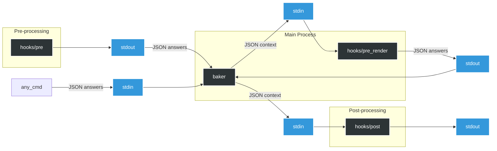

# ¿Qué es Baker?

<div align="center">
  
  <p><strong>Baker</strong> es una herramienta de línea de comandos que te ayuda a <a href="https://en.wikipedia.org/wiki/Scaffold_(programming)">generar el esqueleto</a> de nuevos proyectos rápidamente. Admite <a href="#using-hooks">ganchos</a> independientes del lenguaje para automatizar tareas rutinarias. Baker está escrito en Rust y se distribuye como un binario independiente. Los binarios precompilados están disponibles para las plataformas más populares en la <a href="https://github.com/aliev/baker/releases">página de versiones</a>.</p>
</div>

## Table of Contents

- [Vista general de la arquitectura](#architecture-overview)
- [Instalación](#installation)
- [Ejemplo de plantilla de proyecto](#project-template-example)
  - [Archivo baker.yaml](#bakeryaml-file)
  - [Archivos con extensión .baker.j2](#files-with-bakerj2-extension)
  - [Nombres de archivo plantillados](#templated-file-names)
  - [Archivo .bakerignore](#bakerignore-file)
  - [Importación de plantillas y macros de Jinja](#importing-jinja-templates-and-macros)
  - [Plantillas de bucles y delimitadores](#loop-templates-and-delimiters)
- [Recetas](#recipes)
  - [Pasar respuestas predeterminadas](#passing-default-answers)
  - [Modo no interactivo](#non-interactive-mode)
  - [Preguntas condicionales](#conditional-questions)
  - [Depuración de plantillas](#debugging-templates)
- [Actualización de un proyecto generado](#updating-a-generated-project)
  - [Cómo funciona la actualización](#how-update-works)
  - [Marcadores de conflicto](#conflict-markers)
  - [Mantener las respuestas actualizadas](#keeping-answers-up-to-date)
- [Ganchos (Hooks)](#hooks)
  - [Gancho de pre-renderizado](#pre-render-hook)
  - [Personalización de nombres de archivo de ganchos](#customizing-hook-filenames)
  - [Personalización de ejecutores de ganchos](#customizing-hook-runners)
  - [Mostrar stdout del gancho post](#displaying-post-hook-stdout)
  - [Variables de plataforma disponibles](#available-platform-variables)
- [Preguntas](#questions)
  - [Entrada única](#single-input)
  - [Sí / No](#yes--no)
  - [Elección única](#single-choice)
  - [Elección múltiple](#multiple-choice)
  - [Tipo complejo JSON](#json-complex-type)
  - [Tipo complejo YAML](#yaml-complex-type)
  - [Validación](#validation)
    - [Validación de campo obligatorio](#required-field-validation)
    - [Validación de valor numérico](#numeric-value-validation)
    - [Coincidencia de patrones con expresiones regulares](#pattern-matching-with-regular-expressions)
  - [Preguntas condicionales](#conditional-questions)
- [Filtros integrados](#built-in-filters)
- [Comparando Baker con otros generadores de proyectos](#comparing-baker-to-other-project-generators)
- [Plantillas de la comunidad](#community-templates)

## Vista general de la arquitectura

¿Buscas una visión completa de la base de código? Consulta [`docs/architecture.md`](docs/architecture.md) para un recorrido por el ejecutable de CLI, el cargador de configuración, la capa de prompts, el procesador de plantillas y los módulos de soporte.

## Instalación

Puedes instalar Baker utilizando uno de los siguientes métodos:

### Instalación vía Scoop (Windows)

```ps1
scoop bucket add baker https://github.com/Gasoid/baker-scoop
scoop install baker/baker
```

### Instalación vía Homebrew (macOS)

```bash
brew install aliev/tap/baker
```

### Instalación de binarios precompilados vía script de shell (Linux/macOS)

```bash
curl --proto '=https' --tlsv1.2 -LsSf https://github.com/aliev/baker/releases/latest/download/baker-installer.sh | sh
```

### Instalación de binarios precompilados vía script de PowerShell (Windows)

```powershell
powershell -ExecutionPolicy Bypass -c "irm https://github.com/aliev/baker/releases/latest/download/baker-installer.ps1 | iex"
```

Los binarios precompilados para todas las plataformas compatibles están disponibles en la [página de versiones](https://github.com/aliev/baker/releases).

## Ejemplo de plantilla de proyecto

Para comenzar, puedes usar la plantilla [examples/demo](examples/demo), que demuestra las funciones principales de Baker:

```
│   Configuración de la plantilla.
├── baker.yaml
│
│   El contenido de los archivos con la extensión `.baker.j2` será procesado por el motor de plantillas
├── CONTRIBUTING.md.baker.j2
│
│   cualquier otro archivo se copiará tal cual,
├── README.md
│
│   a menos que estén listados en .bakerignore.
├── .bakerignore
│
│   Los nombres de archivo pueden ser plantillas
├── {{project_slug}}
│   └── __init__.py
│
│   se pueden usar cualquier característica de las plantillas, como condiciones:
└── tests
    └── __init__.py
```

Nota: Por defecto, Baker preserva los enlaces simbólicos. Para copiar el contenido al que apunta el enlace (desreferenciar), establece `follow_symlinks: true` en `baker.yaml`:

```yaml
schemaVersion: v1
follow_symlinks: true
questions: {}
```
Si un enlace simbólico apunta a un archivo, se duplicará como un archivo regular. Los enlaces simbólicos a directorios se recrean actualmente como enlaces simbólicos (no se copian de forma recursiva).

Para comenzar rápidamente, puedes ejecutar el siguiente comando para generar un proyecto:

```
baker generate examples/demo my-project
```

Cada componente de esta plantilla se describe en detalle a continuación.

### Archivo `baker.yaml`

El archivo `baker.yaml` define el directorio como una plantilla. Contiene la configuración de la plantilla y las [preguntas](#question) que se solicitarán al usuario:

```yaml
schemaVersion: v1

questions:
  project_name:
    type: str
    help: Please enter the name of your project

  project_author:
    type: str
    help: "Please enter the author's name for {{project_name}}"

  project_slug:
    type: str
    help: Please enter the project slug (or press Enter to use the default)
    default: "{{ project_name|lower|replace(' ', '_') }}"

  use_tests:
    type: bool
    help: Will your project include tests?
    default: true
```

Los valores de las claves `help` y `default` pueden incluir plantillas para la sustitución de valores. Cada pregunta posterior tiene acceso a las respuestas de las anteriores, como se demuestra en `project_author` y `project_slug`.

Además de YAML, Baker también es compatible con JSON debido a su compatibilidad hacia atrás con JSON. Si existen múltiples archivos de configuración en el directorio de la plantilla, Baker los cargará en el siguiente orden de prioridad: `baker.json`, `baker.yaml` y `baker.yml`.

### Archivos con extensión `.baker.j2`

El contenido de los archivos con la extensión `.baker.j2` será procesado por el motor de plantillas y escrito en el directorio de destino. Los archivos resultantes en el directorio de destino no incluirán la extensión `.baker.j2` en sus nombres.

El contenido de dichos archivos puede incluir las claves de `questions`, que serán reemplazadas por las respuestas proporcionadas por el usuario correspondientes durante el procesamiento. Baker utiliza MiniJinja para este propósito. Para más detalles sobre la sintaxis y las capacidades del motor de plantillas, consulta la documentación de [MiniJinja](https://docs.rs/minijinja/latest/minijinja/).

**Ejemplo:**

**Contenido de CONTRIBUTING.md.baker.j2**

```
  # {{project_name}}
  Author: {{project_author}}
```

**Archivo procesado en el directorio de destino: CONTRIBUTING.md**

```
Content of CONTRIBUTING.md:
  # MyAwesomeProject
  Author: John Doe
```

Nota:
El sufijo de plantilla (predeterminado: .baker.j2) es totalmente configurable en tu archivo baker.yaml usando la opción template_suffix. Puedes establecerlo en cualquier valor, siempre que comience con un . y tenga al menos un carácter después del punto (por ejemplo, .tpl, .jinja, .tmpl). Esto te permite usar extensiones personalizadas para tus archivos de plantilla.

Ejemplo:

```
schemaVersion: v1
template_suffix: ".tpl"
```

Con esta configuración, los archivos que terminan en .tpl se procesarán como plantillas en lugar de .baker.j2.

### Nombres de archivo plantillados

Los nombres de archivos y directorios pueden ser plantillas para ajustarse dinámicamente según la entrada del usuario.

**Ejemplo:**

```yaml
project_name:
  type: str
  help: Please enter the name of your project

project_slug:
  type: str
  help: Please enter the project slug (or press Enter to use the default)
  default: "{{ project_name|lower|replace(' ', '_') }}"
```

```
├── {{project_slug}}
│ └── __init__.py
```

Esto creará un directorio con el nombre según el valor de `project_slug` proporcionado por el usuario.

---

Los nombres de archivos y directorios pueden incluir condiciones que controlen su creación. Si una condición evalúa a `false`, el archivo o directorio correspondiente no se creará. Esta función es especialmente útil con preguntas de tipo [Sí / No](#yes--no), lo que te permite incluir o excluir dinámicamente archivos y directorios específicos basados en las respuestas del usuario.

**Ejemplo:**

```yaml
use_tests:
  type: bool
  help: Will your project include tests?
  default: true
```

```
└── tests
    └── __init__.py
```

En este ejemplo, si el usuario responde "no", el directorio `tests` no se creará.

### Archivo `.bakerignore`

El archivo `.bakerignore` en la raíz de la plantilla se utiliza para excluir archivos y directorios de ser copiados desde la plantilla. Bakerignore utiliza la [sintaxis de Globset](https://docs.rs/globset/latest/globset/#syntax).

Por defecto, Baker ignora los siguientes archivos y patrones:

```rust
const DEFAULT_IGNORE_PATTERNS: &[&str] = &[
    ".git/**",
    ".git",
    ".hg/**",
    ".hg",
    ".svn/**",
    ".svn",
    "**/.DS_Store",
    ".bakerignore",
    "hooks",
    "hooks/**",
    "baker.yaml",
    "baker.yml",
    "baker.json",
];
```

## Importación de plantillas y macros de Jinja

Puedes especificar múltiples patrones para los archivos que se incluirán en el motor de plantillas. Luego podrás [incluir plantillas](https://docs.rs/minijinja/latest/minijinja/syntax/index.html#-include-) o [importar macros](https://docs.rs/minijinja/latest/minijinja/syntax/index.html#-import-) en tus plantillas.

#### Ejemplo:

```yaml
schemaVersion: v1
template_globs:
  - "*.tpl"
  - "*.jinja"
questions:
  project_name:
    type: str
    help: Please enter the name of your project
```

Esto incluirá todos los archivos que terminen en .tpl y .jinja en el motor de plantillas, permitiéndote usarlos en tus plantillas.

### Directorio raíz de importación personalizado

Por defecto, Baker busca plantillas importables (especificadas por `template_globs`) en el directorio raíz de la plantilla. Puedes personalizar este comportamiento usando la opción de configuración `import_root` para especificar un directorio diferente para las importaciones de plantillas.

#### Ejemplo:

```yaml
schemaVersion: v1
import_root: "shared_templates"
template_globs:
  - "*.jinja"
questions:
  project_name:
    type: str
    help: Please enter the name of your project
```

Con esta configuración, Baker buscará archivos `.jinja` en el directorio `shared_templates` (relativo a la raíz de la plantilla) en lugar de la raíz de la plantilla en sí.

**Estructura de la plantilla:**
```
my-template/
├── baker.yaml
├── README.md.baker.j2
└── shared_templates/
    └── macros.jinja
```

**Uso en README.md.baker.j2:**
```jinja

# {{ project_name }}

{{ macros.greeting(project_name) }}
```

El `import_root` puede ser:
- **Ruta relativa**: Se resuelve relativa a la raíz del directorio de la plantilla (por ejemplo, `"shared_templates"` o `"../common"`)
- **Ruta absoluta**: Se usa tal cual (por ejemplo, `"/usr/local/templates"` para compartir plantillas entre múltiples proyectos de Baker)

Esta característica es particularmente útil para:
- **Organizar plantillas**: Mantén las macros y archivos incluidos reutilizables separados de los archivos principales de la plantilla
- **Compartir plantillas**: Usa una ruta absoluta para compartir plantillas comunes entre múltiples proyectos de Baker
- **Bibliotecas de plantillas**: Crea una biblioteca centralizada de componentes de plantilla reutilizables

**Nota:** La característica `import_root` es especialmente útil cuando quieres usar importaciones de plantillas sin incluir la ruta de la carpeta en tus declaraciones de importación. Por ejemplo, en lugar de ``, puedes usar `` cuando `import_root` se establece en `"shared_templates"`. Esto se debe a que las barras inclinadas (`/`) no son válidas en nombres de archivos y causarían problemas si intentaras usar rutas de carpetas en nombres de archivo plantillados como `{{ item.folder }}/{{ item.name }}.md`.


## Plantillas de bucles y delimitadores

Baker admite plantillas de bucles usando bloques for-loop de MiniJinja en nombres de archivo de plantilla. Esto te permite generar múltiples archivos basados en una lista de elementos en tus respuestas.

Por ejemplo, un archivo de plantilla llamado:

```
{{ item.name }}.md.baker.j2
```
generará un archivo para cada elemento en el array `items`, con el nombre de archivo renderizado desde `item.name`.

### loop_separator y loop_content_separator

Al renderizar plantillas de bucles, Baker utiliza dos opciones de configuración para dividir y organizar el contenido generado:

- `loop_separator`: Una cadena utilizada para separar el contenido de cada archivo en la salida renderizada. Esto permite a Baker distinguir entre múltiples archivos generados desde una sola plantilla de bucle. El valor predeterminado es `<--SPLIT-->`.
- `loop_content_separator`: Una cadena utilizada para separar el nombre del archivo del contenido del archivo dentro de cada sección dividida. Esto permite a Baker extraer el nombre de archivo correcto y su contenido correspondiente. El valor predeterminado es `<<CONTENT>>`.

**Uso de ejemplo:**

Supongamos que tu plantilla renderiza la siguiente salida:

```
filename1.md<<CONTENT>>Content for file 1<--SPLIT-->
filename2.md<<CONTENT>>Content for file 2<--SPLIT-->
```

Aquí, `<<CONTENT>>` es el `loop_content_separator` y `<--SPLIT-->` es el `loop_separator`. Baker dividirá la salida en `<--SPLIT-->`, y luego dividirá cada parte en `<<CONTENT>>` para obtener el nombre de archivo y el contenido de cada archivo.

Puedes configurar estos separadores en la configuración de Baker o pasarlos al procesador:

```yaml
schemaVersion: v1
template_suffix: ".baker.j2",
loop_separator: "<--SPLIT-->",
loop_content_separator: "<<CONTENT>>",
```

Este mecanismo permite una generación flexible de múltiples archivos desde una sola plantilla, especialmente útil para generación de código, documentación o cualquier escenario de creación de archivos por lotes.

## Recetas

### Pasar respuestas predeterminadas

Pasar respuestas predeterminadas puede ser útil cuando las respuestas ya se conocen, como en una tubería CI/CD.

Las respuestas predeterminadas se pueden proporcionar usando la opción `--answers`.

**Ejemplo**

```bash
# Alternatively, use --answers='{"name": "John"}'
echo '{"name": "John"}' | baker generate template my-project --answers=-
```

```yaml
schemaVersion: v1
questions:
  name:
    type: str
    help: What is your name?
```

La respuesta proporcionada se utilizará como predeterminada en la solicitud al usuario:

```
What is your name? [John]:
```

#### Modo no interactivo

Para flujos de trabajo completamente automatizados como tuberías CI/CD, puedes combinar `--answers` con la bandera `--non-interactive` para omitir completamente todas las solicitudes:

```bash
baker generate template my-project --answers='{"project_name": "Example Project"}' --non-interactive
```

En el modo `--non-interactive`, Baker determina si debe omitir las solicitudes al usuario basándose en dos factores:

1. La bandera `--non-interactive` en sí
2. Las condiciones `ask_if` de la plantilla (si están definidas)

Cuando se omite una solicitud, Baker utiliza la siguiente estrategia para determinar la respuesta:

1. Si ya se proporcionó una respuesta a través del parámetro `--answers`, utiliza ese valor
2. Si existe un valor predeterminado (`default`) en la configuración de la plantilla, utiliza ese
3. Si ninguno existe, Baker aún solicitará al usuario de forma interactiva para esa pregunta

Por ejemplo, si tu plantilla contiene:

```yaml
schemaVersion: v1
questions:
  project_name:
    type: str
    help: Please enter the name of your project
  project_author:
    type: str
    help: Please enter the author's name
    default: Anonymous
  use_tests:
    type: bool
    help: Will your project include tests?
    default: true
```

Y ejecutas:

```bash
baker generate template my-project --answers='{"project_name": "Example"}' --non-interactive
```

Baker utilizará automáticamente "Example" para `project_name`, "Anonymous" para `project_author` (desde el valor predeterminado) y `true` para `use_tests` (desde el valor predeterminado).

Esto es especialmente útil en entornos CI/CD donde no es posible la entrada interactiva.

#### Preguntas condicionales

Para omitir por completo la solicitud, puedes usar el atributo `ask_if`:

```yaml
schemaVersion: v1
questions:
  name:
    type: str
    help: What is your name?
    # Skips the prompt if "name" was provided in answers
    ask_if: name is not defined or name == ''
```

Una descripción detallada de la clave `ask_if` se puede encontrar en la sección [Preguntas condicionales](#conditional-questions).

### Depuración de plantillas

Dado que Baker utiliza MiniJinja, se beneficia de todas las características de MiniJinja, incluida la depuración. Puedes usar la función `debug()` para inspeccionar el contexto actual.

**Ejemplo**

```yaml
schemaVersion: v1
questions:
  first_name:
    type: str
    help: What is your name?
  last_name:
    type: str
    help: "Hello, {{first_name}}. What is your last name?"
  debug:
    type: str
    help: "{{debug()}}"
```

Cuando ejecutes la plantilla, la función `debug()` mostrará el contexto actual:

```
baker generate example out
What is your name?: aaa
Hello, aaa. What is your last name?: bbb
State {
    name: "temp",
    current_block: None,
    auto_escape: None,
    ctx: {
        "first_name": "aaa",
        "last_name": "bbb",
    },
    env: Environment {
        globals: {
            "debug": minijinja::functions::builtins::debug,
            "dict": minijinja::functions::builtins::dict,
            "namespace": minijinja::functions::builtins::namespace,
            "range": minijinja::functions::builtins::range,
        },
        tests: [
            "!=",
            "<",
            "<=",
            "==",
            ">",
            ">=",
            "boolean",
            "defined",
            "divisibleby",
...
```

Esta salida proporciona una vista detallada del contexto actual, incluidas las variables definidas, sus valores y las funciones disponibles, ayudándote a solucionar problemas y depurar tus plantillas de manera efectiva.

## Actualización de un proyecto generado

Cuando una plantilla evoluciona después de que ya has generado un proyecto a partir de ella, puedes poner el proyecto generado al día con `baker update` en lugar de regenerarlo desde cero.

Después de cada ejecución de `baker generate`, Baker escribe un archivo `.baker-generated.yaml` en el directorio de salida. Este archivo almacena:

- La fuente de la plantilla (ruta local + hash de contenido SHA-256, o URL de Git + SHA del commit + etiqueta opcional)
- Todas las respuestas recopiladas durante la generación
- La marca de tiempo de generación

### Cómo funciona la actualización

1. Ejecuta `baker generate` como de costumbre: esto crea el proyecto y el archivo `.baker-generated.yaml`.
2. Más tarde, cuando la plantilla haya cambiado, `cd` al directorio del proyecto generado y ejecuta:

   ```bash
   baker update
   ```

3. Baker lee `.baker-generated.yaml`, vuelve a obtener la plantilla y compara su hash (local) o commit HEAD (git) con el valor almacenado.
4. Si nada ha cambiado, sale inmediatamente: no hay nada que hacer.
5. Si la plantilla ha cambiado, Baker vuelve a renderizar cada archivo de plantilla usando las respuestas guardadas.

### Marcadores de conflicto

Baker no puede saber si has editado un archivo generado después de la generación. Para estar seguro, cada vez que el contenido recién renderizado de un archivo difiera de lo que hay en disco, Baker escribe **marcadores de conflicto estilo git** en el archivo en lugar de sobrescribirlo en silencio:

```
<<<<<<< current
Content that was on disk (possibly with your local edits)
=======
Newly rendered content from the updated template
>>>>>>> updated
```

Resuelve cada conflicto como lo harías después de un `git merge`, y luego elimina las líneas de marcador. Si el contenido en disco de un archivo ya es idéntico al contenido recién renderizado, Baker lo omite en silencio.

Los archivos binarios (no de texto) que necesitan actualización se escriben junto al original como `<filename>.baker-updated` en lugar de sobrescribirlos o agregar marcadores de texto.

### Mantener las respuestas actualizadas

Por defecto, `baker update` **reutiliza todas las respuestas** de `.baker-generated.yaml`. Si la plantilla ha agregado nuevas preguntas desde la última generación, Baker te las solicitará de forma interactiva (o usará sus valores predeterminados cuando se establezca `--non-interactive`).

Puedes anular respuestas individuales en el momento de la actualización:

```bash
# Override a single answer
baker update --answers='{"project_name": "NewName"}'

# Load overrides from a file
baker update --answers-file=overrides.json
```

La bandera `--generated-file` (o `generated_file_name` en `baker.yaml`) te permite personalizar el nombre del archivo de metadatos si prefieres algo diferente a `.baker-generated.yaml`.

```bash
baker generate my-template my-project --generated-file=.baker-meta.yaml
cd my-project
baker update --generated-file=.baker-meta.yaml
```

## Ganchos (Hooks)

Los ganchos son útiles para realizar tareas rutinarias antes de recopilar respuestas (`pre`), después de recopilar respuestas pero antes de renderizar archivos (`pre_render`), o después de la generación del proyecto (`post`).

Baker ejecuta ganchos como procesos separados, lo que los hace independientes del lenguaje.

Para que un gancho se ejecute, debe cumplir dos requisitos:

1. Debe estar ubicado en el directorio de la plantilla `template_root/hooks/` y nombrado según el `pre_hook_filename`, `pre_render_hook_filename` o `post_hook_filename` especificado en la configuración.
2. Debe ser un archivo ejecutable (`chmod +x template_root/hooks/<hook_filename>`).

Al generar un proyecto que contiene un gancho, Baker emitirá una advertencia:

```
baker examples/hooks out
WARNING: This template contains the following hooks that will execute commands on your system:
examples/hooks/hooks/post
Do you want to run these hooks? [y/N]
```

Esta advertencia se puede omitir usando el parámetro `--skip-confirms=hooks`.

El gancho `pre` puede generar respuestas y pasarlas a `baker` a través de `stdout`:

```python
#!/usr/bin/env python
import json

if __name__ == "__main__":
    # Passing the default answers to baker
    json.dump({"name": "John"}, sys.stdout)
```

El gancho `post` puede consumir las respuestas, que serán pasadas por `baker` al `stdin` del gancho `post`. Las respuestas se pueden analizar de la siguiente manera:

```python
#!/usr/bin/env python
import json
import pathlib
from typing import Any, TypedDict

path = pathlib.Path()

class Input(TypedDict):
    answers: dict[str, Any]
    template_dir: str
    output_dir: str

if __name__ == "__main__":
    context: Input = json.load(sys.stdin)
    output_dir_path = path / context["output_dir"]
    template_dir_path = path / context["template_dir"]
```

### Gancho de pre-renderizado

El gancho `pre_render` se ejecuta después de que Baker ha recopilado respuestas desde valores predeterminados, entrada de CLI, archivos de respuestas, prompts y el gancho `pre`, pero antes de que se rendericen los archivos de plantilla. Recibe el mismo contexto JSON en `stdin` que el gancho `post`:

```json
{
  "template_dir": "path/to/template",
  "output_dir": "path/to/output",
  "answers": {
    "project_name": "demo"
  }
}
```

Si el gancho escribe un objeto JSON en `stdout`, Baker fusiona ese objeto en las respuestas antes de renderizar. Se agregan nuevas claves y se sobrescriben las existentes. Esto es útil cuando una respuesta simple del usuario necesita expandirse a datos estructurados que las plantillas puedan consumir.

Por ejemplo, una plantilla puede solicitar un nombre corto y derivar un valor más rico antes de renderizar:

```yaml
schemaVersion: v1

pre_render_hook_runner:
  - python3

questions:
  project_name:
    type: str
    help: Project name
    default: Demo App
```

`hooks/pre_render`:

```python
#!/usr/bin/env python3
import json
import sys

context = json.load(sys.stdin)
name = context["answers"]["project_name"]
json.dump({"project_slug": name.lower().replace(" ", "-")}, sys.stdout)
```

Las plantillas pueden entonces usar `{{ project_slug }}` como una respuesta normal. Como la salida del gancho `pre`, la salida de `pre_render` debe ser un objeto JSON; el JSON mal formado y las salidas que no son objetos se ignoran con una advertencia.

El diagrama a continuación ilustra este proceso con más detalle



### Personalización de nombres de archivo de ganchos

Por defecto, Baker busca scripts de ganchos llamados `pre`, `pre_render` y `post` en el directorio `hooks` de tu plantilla. Puedes personalizar estos nombres de archivo usando las opciones de configuración `pre_hook_filename`, `pre_render_hook_filename` y `post_hook_filename` en tu archivo `baker.yaml`:

```yaml
schemaVersion: v1

questions:
  # Your regular questions here...

# Custom hook filenames
pre_hook_filename: "setup-environment"
pre_render_hook_filename: "prepare-answers"
post_hook_filename: "finalize-project"
```

Con esta configuración, Baker:

1. Buscará un script de pre-gancho en `template_root/hooks/setup-environment`
2. Buscará un script de pre-render gancho en `template_root/hooks/prepare-answers`
3. Buscará un script de post-gancho en `template_root/hooks/finalize-project`

Los nombres de archivo de los ganchos también admiten cadenas de plantilla, que pueden usarse para crear ganchos específicos de plataforma:

```yaml
schemaVersion: v1

questions:
  license:
    type: str
    help: "Please select a licence for {{platform.os}}"
    default: MIT
    choices:
      - MIT
      - BSD
      - GPLv3
      - Apache Software License 2.0
      - Not open source

pre_hook_filename: "{{platform.family}}/pre"
pre_render_hook_filename: "{{platform.family}}/pre_render"
post_hook_filename: "{{platform.family}}/post"
```

Esta configuración te permite organizar ganchos por plataforma. Por ejemplo:

```
hooks/
├── unix/
│   ├── pre
│   ├── pre_render
│   └── post
└── windows/
    ├── pre
    ├── pre_render
    └── post
```

Baker seleccionará automáticamente el gancho apropiado basado en la plataforma actual.

### Personalización de ejecutores de ganchos

Puedes declarar cómo Baker debe ejecutar scripts de ganchos especificando un ejecutor para cada gancho. Los ejecutores se definen como matrices de cadenas (similar a la sintaxis `ENTRYPOINT` de Docker), lo que te permite incluir el comando y sus argumentos.

```yaml
pre_hook_filename: pre.ps1
pre_hook_runner:
  - powershell
  - -NoLogo
  - -File

post_hook_filename: post.py
post_hook_runner:
  - python3
  - -u

pre_render_hook_filename: pre_render.py
pre_render_hook_runner:
  - python3
  - -u
```

- Si se proporciona un ejecutor, Baker ejecuta el gancho usando el comando suministrado y pasa la ruta renderizada del gancho como el argumento final.
- Si se omite (predeterminado), Baker ejecuta la ruta del gancho directamente, coincidiendo con el comportamiento existente en sistemas Unix con scripts ejecutables.
- Los tokens del ejecutor se renderizan a través del motor de plantillas, por lo que puedes usar variables de `baker.yaml` si es necesario.

Esta característica es especialmente útil en Windows donde scripts como `.ps1` no pueden iniciarse directamente, y en Unix cuando quieres forzar un interpretador específico (por ejemplo, Python, Node.js, Bash).

### Mostrar stdout del gancho post

Por defecto, Baker almacena el `stdout` del gancho `post` solo en los registros de depuración. Si quieres que los usuarios vean los mensajes del gancho post directamente en la terminal (por ejemplo, texto de bienvenida o instrucciones del siguiente paso), habilita `post_hook_print_stdout`:

```yaml
post_hook_filename: post.py
post_hook_runner:
  - python3
post_hook_print_stdout: true
```

Cuando está habilitado, Baker imprime el `stdout` del gancho post en la pantalla después de que el gancho termine. Ten en cuenta que esta salida se vuelve visible en los registros de CI y el historial de la terminal, por lo que los ganchos deben evitar imprimir secretos.

### Variables de plataforma disponibles

Baker proporciona estas variables de plataforma que pueden usarse en plantillas y nombres de archivo de ganchos:

- `platform.os` - Nombre del sistema operativo (por ejemplo, "linux", "macos", "windows")
- `platform.family` - Familia del SO (por ejemplo, "unix", "windows")
- `platform.arch` - Arquitectura de CPU (por ejemplo, "x86_64", "aarch64")

Puedes usar estas variables en cualquier plantilla, incluidos nombres de archivo de ganchos, preguntas, texto de ayuda, valores predeterminados, etc.

## Preguntas

Baker admite varios componentes de preguntas, que se describen a continuación.

### Entrada única

Entrada única solicita al usuario que ingrese un valor de texto.

#### Ejemplo

```yaml
schemaVersion: v1

questions:
  readme_content:
    type: str
    help: Please enter the content for CONTRIBUTING.md
    default: My super duper project
```

- **`type`**: Debe ser `str`.
- **`help`**: Debe ser una cadena, opcionalmente conteniendo una plantilla `minijinja`.
- **`default`**: Debe ser una cadena, opcionalmente conteniendo una plantilla `minijinja`.

#### Resultado

```
Please enter the content for CONTRIBUTING.md []:
```

### Sí / No

#### Ejemplo

```yaml
schemaVersion: v1

questions:
  include_tests:
    type: bool
    help: Do you want to include tests in the generated project?
    default: true
```

- **`type`**: Debe ser `bool`.
- **`help`**: Debe ser una cadena, opcionalmente conteniendo una plantilla `minijinja`.
- **`default`**: Debe ser un valor booleano, predeterminado a `false`.

#### Resultado

```
Do you want to include tests in the generated project? [Y/n]
```

### Elección única

#### Ejemplo

```yaml
schemaVersion: v1

questions:
  favourite_language:
    type: str
    help: What is your favorite programming language?
    default: Rust
    choices:
      - Python
      - Rust
      - Go
      - TypeScript
```

- **`type`**: Debe ser `str`.
- **`help`**: Debe ser una cadena, opcionalmente conteniendo una plantilla `minijinja`.
- **`choices`**: Debe ser una lista de cadenas.
- **`default`**: Debe ser una cadena, opcionalmente conteniendo una plantilla `minijinja`.

#### Resultado

```
What is your favorite programming language?:
  Python
> Rust
  Go
  TypeScript
```

### Elección múltiple

#### Ejemplo

```yaml
schemaVersion: v1

questions:
  favourite_language:
    type: str
    help: What are your favorite programming languages?
    multiselect: true
    default:
      - Python
      - Rust
    choices:
      - Python
      - Rust
      - Go
      - TypeScript
```

- **`type`**: Debe ser `str`.
- **`help`**: Debe ser una cadena, opcionalmente conteniendo una plantilla `minijinja`.
- **`multiselect`**: Debe ser `true` para habilitar elección múltiple.
- **`default`**: Debe ser una lista de cadenas.
- **`choices`**: Debe ser una lista de cadenas.

#### Resultado

```
What are your favorite programming languages?:
  [x] Python
> [x] Rust
  [ ] Go
  [ ] TypeScript
```

### Tipo complejo JSON

El tipo JSON te permite recopilar datos estructurados del usuario en formato JSON. Esto es útil para archivos de configuración, configuraciones de entorno y otros datos estructurados.

#### Ejemplo

```yaml
schemaVersion: v1

questions:
  database_config:
    type: json
    help: Configure your database settings
    schema: |
      {
        "type": "object",
        "required": ["engine", "host", "port"],
        "properties": {
          "engine": {
            "type": "string",
            "enum": ["postgresql", "mysql", "sqlite", "mongodb"]
          },
          "host": {
            "type": "string"
          },
          "port": {
            "type": "integer",
            "minimum": 1,
            "maximum": 65535
          }
        }
      }
    default: |
      {
        "engine": "postgresql",
        "host": "localhost",
        "port": 5432
      }
```

- **`type`**: Debe ser `json`.
- **`help`**: Debe ser una cadena, opcionalmente conteniendo una plantilla `minijinja`.
- **`schema`**: JSON Schema opcional para validación. Sigue el [estándar JSON Schema](https://json-schema.org/).
- **`schema_file`**: Ruta opcional a un archivo JSON Schema externo (relativo a la raíz de la plantilla). Tiene precedencia sobre `schema` en línea.
- **`default`**: Objeto JSON, puede proporcionarse como una cadena u objeto YAML nativo.

#### Carga de esquema desde archivo externo

Para una mejor organización y reutilización, puedes almacenar tu JSON Schema en un archivo separado:

```yaml
schemaVersion: v1

questions:
  database_config:
    type: json
    help: Configure your database settings
    schema_file: database.schema.json
    default: |
      {
        "engine": "postgresql",
        "host": "localhost",
        "port": 5432
      }
```

**database.schema.json:**
```json
{
  "type": "object",
  "required": ["engine", "host", "port"],
  "properties": {
    "engine": {
      "type": "string",
      "enum": ["postgresql", "mysql", "sqlite", "mongodb"]
    },
    "host": {
      "type": "string"
    },
    "port": {
      "type": "integer",
      "minimum": 1,
      "maximum": 65535
    }
  }
}
```

**Beneficios de usar archivos de esquema externos:**
- **Separación de responsabilidades**: Mantén esquemas grandes en archivos separados para una mejor mantenibilidad
- **Reutilización**: Comparte esquemas entre múltiples plantillas o preguntas
- **Control de versiones**: Mejor visualización de diferencias para cambios de esquema
- **Soporte de editor**: La mayoría de los editores proporcionan validación y autocompletado de JSON Schema

**Nota:** No olvides agregar los archivos de esquema a tu `.bakerignore` para evitar que se copien a la salida:

```
# .bakerignore
*.schema.json
```

#### Resultado

Cuando se solicita entrada JSON, al usuario se le dan varias opciones:

1. Abrir en editor de texto externo
2. Ingresar entrada multilínea en la consola

```
Configure your database settings - Choose input method:
> Use text editor
  Enter inline
```

Los datos JSON pueden accederse en las plantillas como cualquier otra estructura anidada:

```
Connection string: {{ database_config.engine }}://{{ database_config.host }}:{{ database_config.port }}
```

### Tipo complejo YAML

El tipo YAML funciona de manera similar al tipo JSON pero utiliza sintaxis YAML, que es más legible y menos verbosa.

#### Ejemplo

```yaml
schemaVersion: v1

questions:
  environments:
    type: yaml
    help: Configure your deployment environments
    default:
      development:
        url: http://localhost:8000
        debug: true
      staging:
        url: https://staging.example.com
        debug: true
      production:
        url: https://example.com
        debug: false
```

- **`type`**: Debe ser `yaml`.
- **`help`**: Debe ser una cadena, opcionalmente conteniendo una plantilla `minijinja`.
- **`schema`**: JSON Schema opcional para validación (mismo formato que para el tipo JSON).
- **`schema_file`**: Ruta opcional a un archivo JSON Schema externo (relativo a la raíz de la plantilla). Tiene precedencia sobre `schema` en línea.
- **`default`**: Datos YAML, pueden proporcionarse como una cadena u objeto YAML nativo.

Al igual que el tipo JSON, las preguntas YAML también admiten archivos de esquema externos usando `schema_file`. Consulta la sección [Tipo complejo JSON](#json-complex-type) para obtener detalles sobre el uso de archivos de esquema externos.

#### Resultado

Similar a la entrada JSON, al usuario se le solicita elegir un método de entrada. YAML es particularmente útil para datos de configuración debido a su legibilidad:

```
Define your environments:

development:
  url: http://localhost:8000
  debug: true
staging:
  url: https://staging.example.com
  debug: true
production:
  url: https://example.com
  debug: false
```

Uso en plantillas:

```

[{{ env_name }}]
URL={{ env_config.url }}
DEBUG={{ env_config.debug }}


```

### Validación

Baker admite la validación de respuestas usando el atributo `validation`. El atributo `condition` usa el lenguaje de expresiones de MiniJinja para validar la entrada del usuario, mientras que `error_message` proporciona retroalimentación cuando la validación falla.

#### Validación de campo obligatorio

Asegura que un campo no esté vacío:

```yaml
schemaVersion: v1

questions:
  age:
    type: str
    help: "Enter your age"
    validation:
      condition: "age"
      error_message: "Value cannot be empty"
```

#### Validación de valor numérico

Comprueba si un valor numérico cumple ciertos criterios:

```yaml
schemaVersion: v1

questions:
  age:
    type: str
    help: "Enter your age"
    validation:
      condition: "age|int >= 18"
      error_message: "You must be at least 18 years old. You entered {{age}}."
```

El mensaje de error puede incluir variables de plantilla para proporcionar contexto sobre la entrada no válida.

#### Coincidencia de patrones con expresiones regulares

Validación compleja que combina coincidencia de patrones regex con validación numérica y mensajes de error detallados:

```yaml
schemaVersion: v1

questions:
  age:
    type: str
    help: Enter your age
    validation:
      condition: "age and (age|regex('[0-9]')) and (age|int >= 18)"
      error_message: >
        Age is required field
        Age must be numeric
        You must be at least 18 years old. You entered {{age}}
        Invalid input
        
```

Este ejemplo demuestra:

1. Validación de campo obligatorio usando `age`
2. Coincidencia de patrones usando `regex('[0-9]')` para asegurar entrada numérica
3. Validación de valor numérico asegurando que la edad sea al menos 18
4. Mensajes de error condicionales que proporcionan retroalimentación específica basada en el fallo de validación

Si la validación falla, Baker:

1. Mostrará el mensaje de error apropiado
2. Limpiará la respuesta no válida
3. Solicitará al usuario que intente de nuevo

### Preguntas condicionales

El atributo `ask_if` se utiliza para controlar la visualización de una pregunta, usando el [lenguaje de expresiones](https://docs.rs/minijinja/latest/minijinja/#expression-usage) de MiniJinja. Permite lógica condicional para determinar si se debe solicitar una pregunta basándose en la entrada del usuario u otros factores contextuales. En el siguiente ejemplo, la pregunta `py_framework` solo se solicita si el usuario selecciona `Python` como lenguaje de programación en la pregunta `language`:

```yaml
schemaVersion: v1

questions:
  language:
    type: str
    help: What is your programming language?
    default: Rust
    choices:
      - Python
      - Rust
      - Go
      - TypeScript
  py_framework:
    type: str
    help: What is your Python framework?
    choices:
      - Django
      - FastAPI
      - Pyramid
      - Tornado
    ask_if: "language == 'Python'"
```

## Filtros integrados

Baker proporciona un conjunto de filtros y funciones integrados para mejorar la flexibilidad de tus plantillas. Estos funcionan gracias al motor de plantillas MiniJinja y filtros personalizados adicionales.

### Filtros disponibles

| **Nombre del filtro**        | **Descripción**                                               |
| ---------------------- | ------------------------------------------------------------- |
| `camel_case`           | Convierte una cadena a camelCase.                               |
| `kebab_case`           | Convierte una cadena a kebab-case.                              |
| `pascal_case`          | Convierte una cadena a PascalCase.                              |
| `screaming_snake_case` | Convierte una cadena a SCREAMING_SNAKE_CASE.                    |
| `snake_case`           | Convierte una cadena a snake_case.                              |
| `table_case`           | Convierte una cadena a table_case (minúsculas con guiones bajos). |
| `train_case`           | Convierte una cadena a Train-Case.                              |
| `plural`               | Convierte una palabra a su forma plural.                           |
| `singular`             | Convierte una palabra a su forma singular.                         |
| `foreign_key`          | Convierte una cadena a formato de clave externa (por ejemplo, `user_id`).  |
| `regex`                | Aplica una expresión regular para transformar una cadena.           |

### Ejemplos de uso

#### 1. Filtro Camel Case

```yaml
{{ "hello world" | camel_case }}
// Salida: "helloWorld"
```

#### 2. Filtro Kebab Case

```yaml
{{ "hello world" | kebab_case }}
// Salida: "hello-world"
```

#### 3. Filtro Pascal Case

```yaml
{{ "hello world" | pascal_case }}
// Salida: "HelloWorld"
```

#### 4. Filtro Screaming Snake Case

```yaml
{{ "hello world" | screaming_snake_case }}
// Salida: "HELLO_WORLD"
```

#### 5. Filtro Snake Case

```yaml
{{ "hello world" | snake_case }}
// Salida: "hello_world"
```

#### 6. Filtro Table Case

```yaml
{{ "Hello World" | table_case }}
// Salida: "hello_world"
```

#### 7. Filtro Train Case

```yaml
{{ "hello world" | train_case }}
// Salida: "Hello-World"
```

#### 8. Filtro Plural

```yaml
{{ "car" | plural }}
// Salida: "cars"
```

#### 9. Filtro Singular

```yaml
{{ "cars" | singular }}
// Salida: "car"
```

#### 10. Filtro Clave Externa

```yaml
{{ "User" | foreign_key }}
// Salida: "user_id"
```

#### 11. Filtro Regex

```yaml
{{ "hello world" | regex: "world", "Rust" }}
// Salida: "hello Rust"
```

## Comparando Baker con otros generadores de proyectos

| Característica                                           | Baker                                                                                | Kickstart     | cargo-generate         | Copier                                    | Cookiecutter              | Yeoman                       |
|---------------------------------------------------|--------------------------------------------------------------------------------------|---------------|------------------------|-------------------------------------------|---------------------------|------------------------------|
| 🟢 **Entrada JSON/YAML estructurada**                 | ✅ Soporte nativo con validación y esquema                                          | ❌             | ❌                      | ⚠️ Limitado                                | ❌                         | ⚠️ Se requiere lógica personalizada     |
| 🟢 **Validación de JSON Schema**                     | ✅ Aplicar validez de datos con JSON Schema estándar                                    | ❌             | ❌                      | ❌                                         | ❌                         | ⚠️ Se requiere lógica personalizada     |
| 🟢 **Modos de edición de datos complejos**                 | ✅ Entrada de Editor/Consola/Archivo para datos estructurados                                      | ❌             | ❌                      | ❌                                         | ❌                         | ❌                            |
| 🟢 **Soporte de debug() en plantilla**                | ✅ Usa `{{ debug() }}` para inspeccionar el contexto                                             | ❌             | ❌                      | ❌                                         | ❌                         | ⚠️ Solo vía console.log      |
| 🟢 **Comunicación estructurada de ganchos**              | ✅ Los ganchos pre/post intercambian JSON estructurado vía stdin/stdout                           | ❌             | ❌                      | ❌                                         | ❌                         | ❌                            |
| 🟢 **Ejecución segura de ganchos**                        | ✅ Advierte antes de ejecutar ganchos                                                       | ❌             | ❌                      | ❌                                         | ❌                         | ⚠️ Depende del generador      |
| 🟢 **Control de versiones de esquema para configuración**               | ✅ La versión del esquema asegura compatibilidad hacia atrás entre versiones de Baker                | ✅             | ❌                      | ❌                                         | ❌                         | ❌                            |
| 🟢 **Soporte de configuración YAML & JSON**                 | ✅ Soporta configuraciones `yaml` **y** `json`                                      | ❌ Solo TOML   | ❌ Solo TOML            | ❌ Solo YAML                               | ❌ Solo JSON               | ❌ En código JS                 |
| 🟢 **Ganchos específicos de plataforma**                    | ✅ Usa `{{platform.family}}/pre` etc. para lógica consciente del SO                              | ❌             | ⚠️ Limitado vía Rhai    | ❌                                         | ❌                         | ⚠️ Se requiere lógica personalizada     |
| 🟢 **Enrutamiento de respuestas amigable con CI/CD**              | ✅ `--answers=-` o eco JSON en CLI                                                | ❌             | ⚠️ Parcial             | ✅ Vía YAML prellenado                     | ⚠️ Solo `--no-input`      | ❌ Scripting manual           |
| 🟢 **Ligero y Rápido**                         | ✅ Binario en Rust, sin dependencias de tiempo de ejecución                                               | ✅ Binario Rust | ✅ Binario Rust          | ❌ Requiere Python                         | ❌ Requiere Python         | ❌ Requiere Node.js           |
| 🟢 **Interfaz CLI simple**                       | ✅ `baker generate <plantilla> <salida>` + `baker update` para actualizaciones de plantilla        | ✅ Simple      | ❌ Requiere uso de Cargo | ❌ Más verboso                            | ✅ Simple                  | ❌ Requiere instalación de generador |
| 🟢 **Actualización / regeneración de plantilla**            | ✅ `baker update` con marcadores de conflicto y reutilización de respuestas                              | ❌             | ❌                      | ✅ `copier update` completo                    | ❌                         | ❌                            |
| 🟢 **Ganchos agnósticos del lenguaje**                    | ✅ Los ganchos pueden estar en _cualquier_ lenguaje (Bash, Python, etc.)                                | ✅ Sí         | ⚠️ Solo scripting Rhai | ✅ Sí                                     | ✅ Sí                     | ❌ Solo JS                    |
| 🟢 **Nombres de archivo/directorio plantillados**                   | ✅ Plantillado completo de MiniJinja en nombres y condiciones                                    | ✅ Sí         | ✅ Sí                  | ✅ Sí                                     | ✅ Sí                     | ✅ Vía lógica JS               |
| 🟢 **Prompts y predeterminados plantillados**               | ✅ Predeterminados dinámicos usando MiniJinja, condicional vía `ask_if`                         | ✅ Sí         | ⚠️ Limitado             | ✅ Jinja completo                              | ❌ Solo estático             | ✅ Control completo en JS         |
| 🟢 **Archivo de ignorado basado en Glob**                     | ✅ `.bakerignore` con sintaxis avanzada de Globset                                        | ✅ Sí         | ✅ Sí                  | ✅ `_exclude`                              | ⚠️ `_copy_without_render` | ❌ Filtro manual en código      |
| 🟢 **Binarios multiplataforma**                    | ✅ Precompilados para Linux, macOS, Windows                                              | ✅ Sí         | ✅ Sí                  | ✅ Sí                                     | ✅ Sí                     | ✅ Sí                        |
| 🟢 **Generación de esqueletos agnóstica del lenguaje**              | ✅ Funciona con cualquier lenguaje / stack                                                    | ✅ Sí         | ❌ Enfocado en Rust         | ✅ Sí                                     | ✅ Sí                     | ⚠️ Centrada en JS                |
| 🟢 **Respuestas accesibles en preguntas posteriores**      | ✅ Todas las respuestas anteriores disponibles vía MiniJinja en `default`, `help`, `ask_if`        | ⚠️ Limitado    | ⚠️ Parcial (vía Rhai)  | ✅ Sí (contexto Jinja)                     | ❌                         | ✅ Control completo en JS         |
| 🟢 **Motor plantillado**                           | ✅ Plantillado rápido, seguro y tipo Jinja2 incrustado en Rust                                | Tera          | Liquid                 | Jinja2                                    | Jinja2                    | EJS                          |
| 🟢 **Bucles de archivos (bucles de nombre de plantilla)** | ✅ Generar múltiples archivos desde una sola plantilla usando bucles for de Jinja2 en nombres de archivo | ❌             | ❌                      | ⚠️ Limitado (bucles Jinja2 solo en contenido) | ❌                         | ⚠️ Se requiere lógica personalizada     |

### ℹ️ Descargo de responsabilidad

Esta comparación se realizó basada en la documentación disponible. Si notas alguna **inexactitud o información desactualizada**, por favor [crea un issue](https://github.com/aliev/baker/issues) — estaré encantado de actualizar la tabla en consecuencia.

## Plantillas de la comunidad

Consulta [aquí](https://github.com/topics/baker-template) una lista de plantillas mantenidas por la comunidad creadas con baker.
