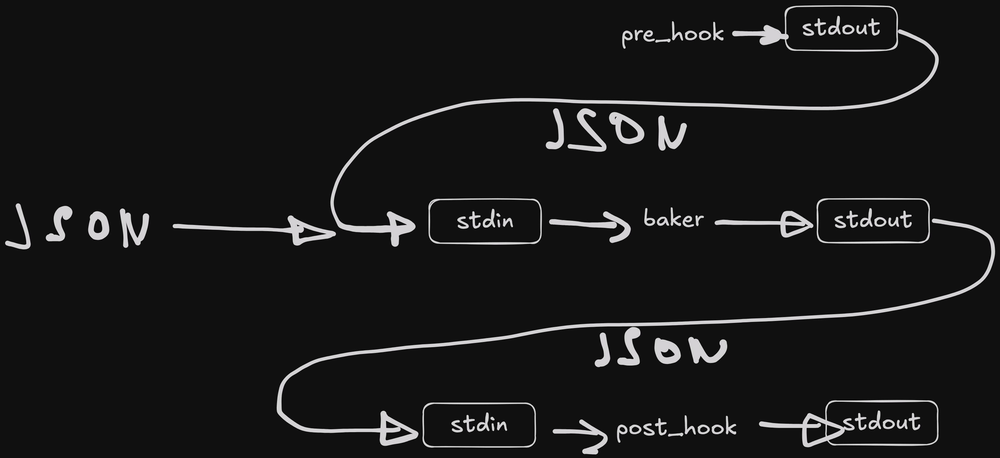

<div align="center">
  
  <p><strong>baker: a fast project scaffolding tool written in Rust that generates projects from minijinja templates.</strong></p>
</div>

## Overview

**Baker** is inspired by [cookiecutter](https://github.com/cookiecutter/cookiecutter) and [copier](https://github.com/copier-org/copier), but distinguishes itself by:

- Being written in Rust for enhanced speed and reliability.
- Not requiring Python dependencies.
- Providing a unified binary for seamless usage.
- Uses [Minijinja](https://github.com/mitsuhiko/minijinja) as a template engine.

## Features

- **Interactive Prompt**: Asks for template variables interactively.
- **Git Repository Support**: Generate templates directly from Git repositories.
- **Language Independent Hooks:** Hooks can be written in any language.
- **File Exclusion**: `.bakerignore` to specify files/directories to exclude.
- **File Interpolation**: Template variable interpolation in filenames.
- **Configurable**: Uses `baker.json`, `baker.yaml`, or `baker.yml` for configuration.

## Installation

### Build from Source

To build Baker from the source, ensure you have Rust installed and run the following command:

```bash
cargo install --path .
```

## Usage

Generate a project from a template with the following command:

```bash
baker [OPTIONS] <TEMPLATE> <OUTPUT_DIR>
```

### Arguments

- **TEMPLATE**: Path to a local template or a GitHub repository (e.g., `user/repo`).
- **OUTPUT_DIR**: Directory where the generated project will be created.

### Options

- `-f, --force` : Force overwrite of an existing output directory.
- `-v, --verbose` : Enable verbose logging output.
- `--skip-hooks-check` : Skip confirmation prompt for executing hooks.
- `-c, --context <CONTEXT>` : Provide context from arguments (as JSON) instead of interactive prompts.
- `-h, --help` : Show help information.
- `-V, --version` : Show version information.

## Template Structure

Baker processes files with a `.j2` extension (Minijinja template files) for generating the final output. For example, `main.py.j2` is processed and copied as `main.py`. You can use Minijinja features such as conditions and filters within filenames as well.

Example template structure:

```
template/
├── baker.json           # Template configuration
├── .bakerignore         # Files to ignore (optional)
├── .dockerignore.j2     # Will be processed as `.dockerignore`
├── main.py.j2           # Will be processed as `main.py`
├── tests.py.j2   # Conditional file
├── hooks/               # Hooks (optional)
│   ├── pre_gen_project  # Executed before project generation
│   └── post_gen_project # Executed after project generation
└── ... other template files ...
```

## Configuration

Templates can be configured via a `baker.json` file placed in the root directory of the template. This file defines the variables required by the template.

Example `baker.json`:

```json
{
  "create_tests": {
    "type": "bool",
    "help": "Should I generate tests.py file?",
    "default": true
  },
  "licence": {
    "type": "str",
    "choices": ["MIT", "Apache"],
    "help": "What is your licence?"
  },
  "project_name": {
    "type": "str",
    "help": "What is your project name?"
  },
  "project_slug": {
    "type": "str",
    "help": "What is your project slug?",
    "default": "{{ project_name|lower|replace(' ', '_') }}"
  }
}
```

This configuration will prompt users for necessary details when generating a project.

### Example Usage with Interactive Prompt

```bash
baker examples/python-package baker-example
```

This command will prompt you interactively for template variables.

### Example Usage with Context Provided as JSON

```bash
baker examples/python-package baker-example --context '{"generate_main": true, "licence": "MIT", "project_name": "Baker Python package", "project_slug": "baker"}'
```

This command allows skipping the interactive prompts by providing all required values.

### Hooks flow

<div align="center">
  
</div>
